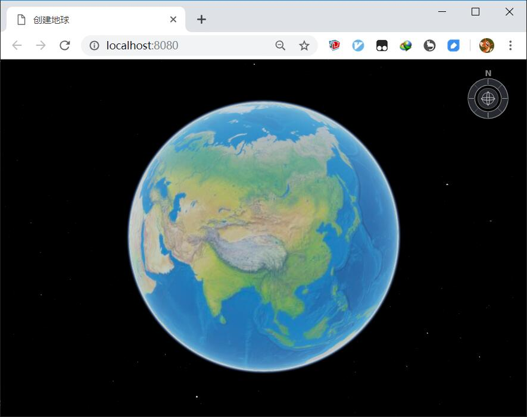

# 基于EarthSDK创建的极简App

## 简介

基于webpack，创建一个简单的基于EarthSDK的App。
这是一个极其简单的示例，说明了EarthSDK是如何引用的。

缺点是EarthSDK需要手动拷贝，没有通过npm install earthsdk的方式来引入。



## 使用方法

1. npm install -g http-server // 全局安装http-server，如果已经安装，则可跳过此步骤
2. 当前目录下执行命令 hs -p 8080 // 启动http-server服务器
3. 打开chrome浏览器，输入网址: localhost:8080

## 附带：EarthSDK使用方法

1. html文件中引入XbsjEarth.js
```html
<script src="./earthsdk/dist/XbsjEarth/XbsjEarth.js"></script>
```

2. 脚本中创建earth，其中```earthContainer```为承载三维地球的div窗口的id。
```javascript
var earth = new XE.Earth('earthContainer');
```
